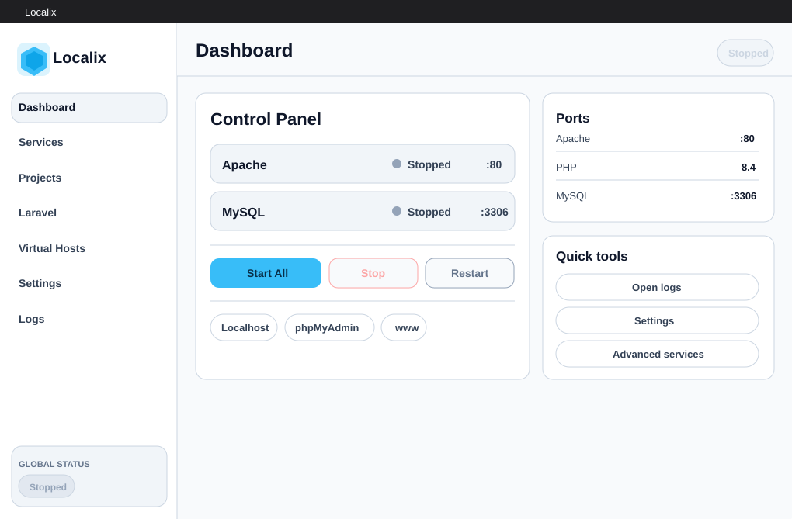

# Localix


Localix is a simple local server manager for Windows. It helps you run Apache, PHP, MySQL, phpMyAdmin, local projects, Virtual Hosts, and Laravel project workflows from one clean desktop app.

Localix is built for local web development: start your stack quickly, keep projects in one `www` folder, and manage common server tasks without opening multiple config files.



## Download

Download the latest public release here:

https://github.com/kurnya/Localix/releases/latest

Available release files:

- `localix.setup.exe` - standard Windows installer.
- `localix.0.1.0.x64.exe` - portable Windows build.
- `Installation.Guide.md` - installation and first-run guide.
- `SHA256SUMS.txt` - checksum file for verification.

For full setup steps, read:

[Installation Guide](Installation%20Guide.md)

## Features

**Simple Control Panel**  
Start, stop, and restart Apache and MySQL from one desktop app.

**Bundled Local Stack**  
Apache, PHP 8.4, MySQL, phpMyAdmin, and Composer are included in the release build.

**Clean Localhost Dashboard**  
The `localhost` page shows Localix branding, server status, ports, phpMyAdmin access, and detected projects.

**Live Project Scanner**  
Projects inside the `www` folder are scanned while the app is running. The Projects and Virtual Hosts pages update automatically.

**No MySQL Windows Service**  
MySQL runs as a Localix-managed process and stores data inside the Localix data folder.

**Virtual Hosts**  
Generate local domains such as:

```text
http://my-project.locx
```

**Laravel Helper**  
Create Laravel projects directly from Localix using Composer.

**Logs and Maintenance Tools**  
Open logs, repair phpMyAdmin config, check services, and manage common local-server tasks from the app.

**Theme Support**  
Use light, dark, or system theme.

## Quick Start

1. Download `localix.setup.exe` from the latest release.
2. Install and open Localix.
3. Click `Start All`.
4. Open:

```text
http://localhost
http://localhost/phpmyadmin
```

5. Put your projects inside the `www` folder.

Default ports:

```text
Apache: 80
MySQL: 3306
```

If port `80` is already used by another app, run Localix as Administrator or change the Apache port in Settings.

## Project Folder Rules

- Put project folders directly inside `www`.
- `phpmyadmin` is reserved and ignored by the project scanner.
- Laravel projects use the `public` folder automatically when available.

Example:

```text
www/my-project -> http://localhost/my-project/
```

## Virtual Hosts

Virtual Hosts are optional. When enabled, folders inside `www` can be accessed with `.locx` domains.

Example:

```text
www/my-project -> http://my-project.locx
```

For Virtual Hosts, you may need to add entries to the Windows hosts file:

```text
127.0.0.1 my-project.locx
```

Hosts file location:

```text
C:\Windows\System32\drivers\etc\hosts
```

After generating Virtual Host config, restart Apache if it is already running.

## Security Notice

Localix is currently distributed as an unsigned Windows app. Windows SmartScreen or antivirus software may show an unknown publisher warning because the app is new and includes local server binaries.

Only download Localix from the official GitHub Releases page:

https://github.com/kurnya/Localix/releases

You can verify release files with `SHA256SUMS.txt`.

## Public Repository Notice

This repository is for public downloads, documentation, screenshots, checksums, and release notes only. The main source code is not distributed publicly.

## License

Localix is proprietary software. Public release assets are provided for installation and documentation purposes.
